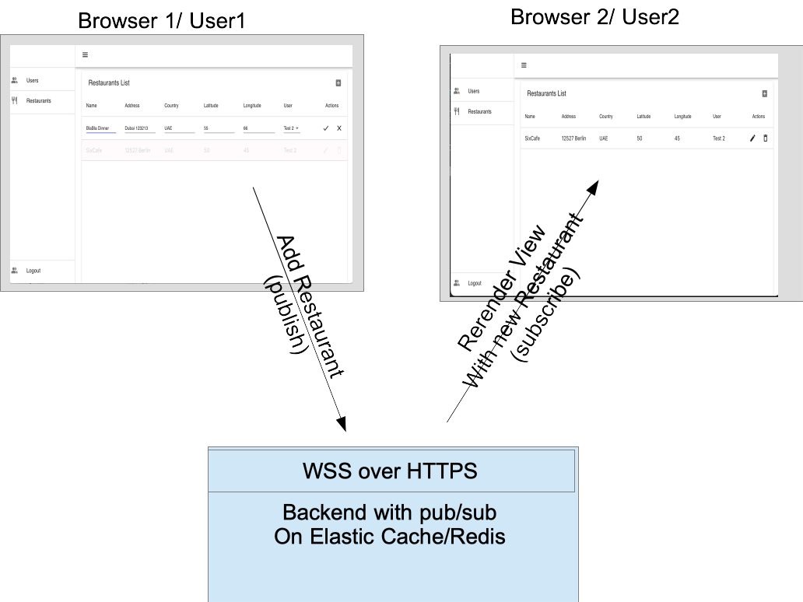

# project components (compact version)
App challenge for full stack developers and devops. The project contains a local development environment.
- database:  docker postgres with database config inititialization (see [REDAME.md](database/README.md) )
- backend:  nest.js backend with CRUD to a user resource and api (see [REDAME.md](backend/README.md) )
- frontend: next.js with a simple page with table view (crud user resource) + left side bar (see [REDAME.md](frontend/README.md) )
- CI/CD with  .github/workflow 1) deploy frontend to firebase hosting 2) deploy backend to AWS Fargate  (see [REDAME.MD](devops/README.MD) )
- devops:  terraform scripts to setup AWS environment ( (see [REDAME.MD](devops/README.MD) ))  

# challenge
Run frontend && backend and discover the challenge tasks. 
Deliver a full production app (AWS in free tier limit, IAM access will be granted) on a serverless backend 
- SPA production  https://app.biedka.com  (Firebase Hosting) staging https://app-staging.biedka.com  (Firebase Hosting)
- Backend: https://api-app-challenge.biedka.com (AWS ECS hosting)
- Database: use  AWS RDS    
- Logging backend with cloudwatch 
- Logging frontend with firebase analytics 

- Group task: Extend existing app to shared desktop feature over websocket pub/sub 
Scenario (see diagramm):
    1. User2 opens Restaurant view (order by desc updatedAt) and subscribes for updates on the restaurant list
    2. User1 is also subscribes to the restaurant-list on open the view
    3. User1 will add new restaurant over RESTful api (publish)
    4. Backend will save the the record in the datebase and lookup who is subscriped for updates
    5. Backend will send a notification with payload to all subscribers (except User1)
    5. User2 will receive the notification with new restaurant object as payload and will rerender the view
    6. User1 view is in now in sync with User2 view (shared desktop)

 
# solution
Don't re-invet solutions , pls. follow community and industry standards. 

# branching
Contribute on your own branch , don't merge into master branch 
