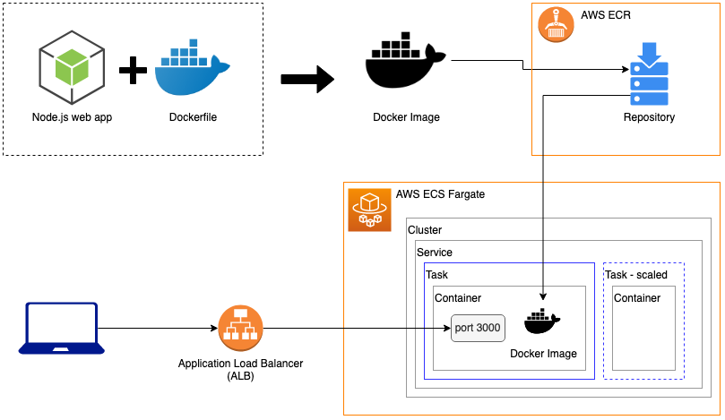
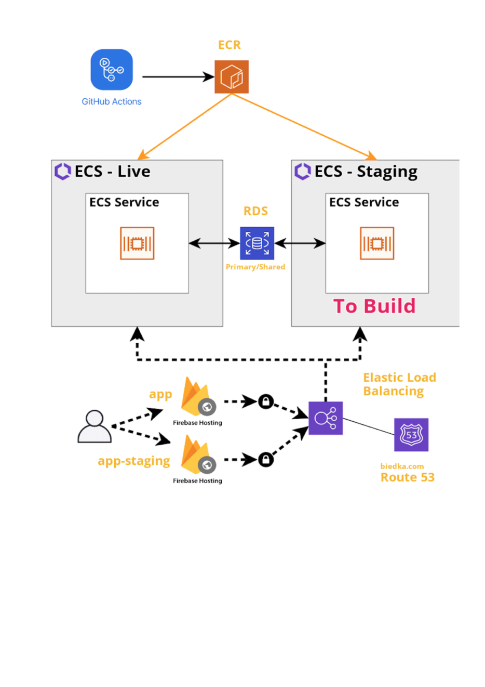

# Extend serverless AWS stack with ECS and RDS for staging 
- Please contact repo owner and ask for IAM access (FullAdmin)
- Select only AWS service/types inside free tier limit
 

## Manage Secret with AWS secret manager 
- fetch only secrets on container creation 
- add jwt-secret and RDS credentials to Secret Manager

## Resources
- Route53 contains hosted domain: biedka.com 
- devops folder contains a 90 day SSLcert for api-app-challenge.biedka.com , but not need in ECS (will generate one)

## CI/CD
- use github actions to deploy to AWS ECS 
- Extend the existing CD pipe for a staging system integeration  
- Extend the existing CD pipe with db migrations jobs after unit test

## Docker Registry 
- v1:  use ECS serverless github action (manually triggered) for hosting
- v2:  github container registry (with your github PAT), git, maybe you will need it in your development environments (esp. frontend devs)

## AWS setup status quo (see terraform-scripts) 

## Target AWS setup  (Task Todo)
- extend terraform scripts to add a staging env 
- RDS service is shared (staging will use a dedicated database via config )

